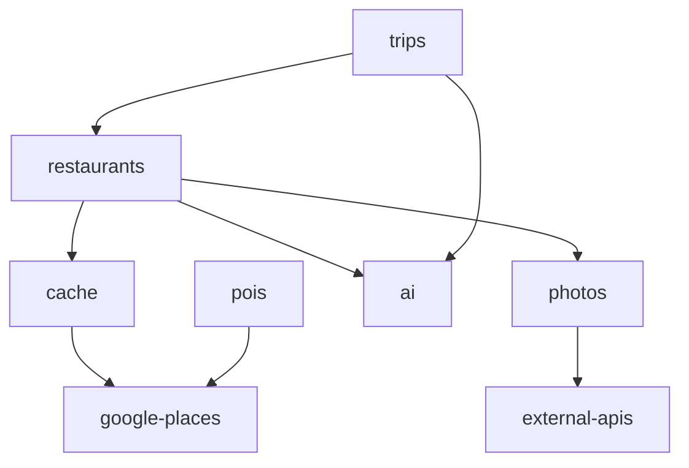

# 🏗️ Backend Architecture

Clean, modular architecture organized by business domains.

## 📁 Project Structure

```
triply-workers/
├── src/
│   ├── modules/              # Business domain modules
│   │   ├── google-places/    # Google Places API integration
│   │   ├── cache/            # 30-day caching system
│   │   ├── restaurants/      # Restaurant business logic
│   │   ├── photos/           # Image management
│   │   ├── ai/               # OpenAI and AI services
│   │   ├── trips/            # Trip generation
│   │   ├── pois/             # Points of Interest
│   │   ├── cities/           # City data management
│   │   └── external-apis/    # Third-party APIs
│   │
│   └── shared/               # Common code
│       ├── config/           # Environment & DB config
│       ├── types/            # TypeScript types
│       ├── utils/            # Helper functions
│       └── database/         # Database utilities
│
├── scripts/
│   └── migrations/           # SQL migrations
│
├── diagnose-restaurants-view.ts
├── test-after-migration.ts
├── run-migrations.ts
└── package.json
```

---

## 📦 Modules

### 🗺️ google-places/
**Purpose:** Google Places API integration

```
google-places/
├── services/
│   ├── google-places.service.ts        # Main API client
│   └── google-places-photos.service.ts # Photos API
├── types/                              # API response types
└── index.ts                            # Module exports
```

**Usage:**
```typescript
import { GooglePlacesService } from '@/modules/google-places';

const places = await GooglePlacesService.textSearch({ query: 'restaurants in Paris' });
```

---

### 💾 cache/
**Purpose:** Google-compliant 30-day data caching

```
cache/
├── services/
│   └── places-cache.service.ts    # Cache management
├── jobs/
│   ├── refresh-places-cache.ts    # Auto-refresh (15 days)
│   └── cleanup-expired-cache.ts   # Auto-cleanup (30 days)
├── types/                         # Cache types
└── index.ts
```

**Key Features:**
- ✅ place_id stored forever
- ✅ Other data cached 30 days max
- ✅ Auto-refresh every 15 days
- ✅ Auto-cleanup after 30 days

**Usage:**
```typescript
import { PlacesCacheService } from '@/modules/cache';

await PlacesCacheService.cachePlace(catalogId, placeDetails);
```

---

### 🍽️ restaurants/
**Purpose:** Restaurant-specific business logic

```
restaurants/
├── services/
│   └── restaurant-cache.service.ts           # Restaurant cache API
├── jobs/
│   ├── seed-cached-restaurants.ts            # Seed script
│   ├── seed-paris-restaurants.ts             # Paris-specific seed
│   └── enrich-restaurants-opening-hours.ts   # Opening hours enrichment
├── types/                                    # Restaurant types
└── index.ts
```

**Usage:**
```typescript
import { RestaurantCacheService } from '@/modules/restaurants';

const restaurants = await RestaurantCacheService.getRestaurantsByCity('Paris');
```

---

### 📸 photos/
**Purpose:** Image management and Google Places photos

```
photos/
├── services/
│   ├── hybrid-image-gallery.service.ts  # Multiple sources
│   └── image-gallery.service.ts         # Single source
├── jobs/
│   ├── fetch-photos-textsearch.ts       # Text search photos
│   └── fetch-restaurant-photos.ts       # Restaurant photos
└── index.ts
```

---

### 🤖 ai/
**Purpose:** OpenAI and AI services

```
ai/
├── services/
│   └── openai.service.ts                       # OpenAI API client
├── jobs/
│   └── generate-restaurant-descriptions.ts     # AI descriptions
└── index.ts
```

**Usage:**
```typescript
import { OpenAIService } from '@/modules/ai';

const description = await OpenAIService.generateRestaurantDescription(restaurant);
```

---

### 🗺️ trips/
**Purpose:** Trip generation and management

```
trips/
├── jobs/
│   └── generate-trips.ts    # AI trip generation
└── index.ts
```

---

### 📍 pois/
**Purpose:** Points of Interest management

```
pois/
├── jobs/
│   ├── import-pois-for-cities.ts      # Import POIs
│   └── enrich-pois-opening-hours.ts   # Enrich hours
└── index.ts
```

---

### 🏙️ cities/
**Purpose:** City data management

```
cities/
├── jobs/
│   └── import-geonames-cities.ts    # GeoNames import
└── index.ts
```

---

### 🔌 external-apis/
**Purpose:** Third-party API integrations

```
external-apis/
├── services/
│   ├── foursquare.service.ts    # Foursquare API
│   └── unsplash.service.ts      # Unsplash API
└── index.ts
```

---

## 🔧 Shared Module

### shared/config/
- `env.ts` - Environment variables
- `supabase.ts` - Supabase client

### shared/types/
- Common TypeScript types
- Database models

### shared/utils/
- Helper functions
- Common utilities

---

## 🎯 Design Principles

### 1. Domain-Driven Design (DDD)
Each module represents a business domain with:
- **Services** - Business logic
- **Jobs** - Background tasks
- **Types** - Domain models

### 2. Single Responsibility
Each module has one clear purpose:
- `google-places/` - Only Google API
- `cache/` - Only caching
- `restaurants/` - Only restaurant logic

### 3. Clear Dependencies
```
restaurants → cache → google-places
     ↓
   photos → external-apis
     ↓
    ai → openai
```

### 4. Easy Imports
```typescript
// ✅ Clean
import { GooglePlacesService } from '@/modules/google-places';
import { RestaurantCacheService } from '@/modules/restaurants';

// ❌ Avoid
import GooglePlacesService from '../../../services/google-places.service';
```

---

## 📜 Scripts

### Seed Data
```bash
npm run seed:restaurants:paris    # Seed Paris restaurants
```

### Cache Management
```bash
npm run cache:refresh              # Refresh cache (15+ days)
npm run cache:cleanup              # Cleanup expired (30+ days)
```

### Diagnostics
```bash
npx tsx diagnose-restaurants-view.ts    # Diagnose issues
npx tsx test-after-migration.ts         # Test migrations
```

---

## 🚀 Adding New Modules

### 1. Create Module Structure
```bash
mkdir -p src/modules/your-module/{services,jobs,types}
```

### 2. Add Service
```typescript
// src/modules/your-module/services/your.service.ts
class YourService {
  // Business logic
}

export default YourService;
```

### 3. Create Index
```typescript
// src/modules/your-module/index.ts
export { default as YourService } from './services/your.service.js';
```

### 4. Use in Code
```typescript
import { YourService } from '@/modules/your-module';
```

---

## 📊 Module Dependencies



---

## ✅ Benefits

1. **清晰的职责分离** - Each module owns its domain
2. **Easy to Navigate** - Find code by business logic
3. **Scalable** - Add new modules without refactoring
4. **Testable** - Modules can be tested independently
5. **Team-Friendly** - Multiple devs can work on different modules

---

## 📝 Migration from Old Structure

### Old (Flat)
```
src/
├── services/
│   ├── google-places.service.ts
│   ├── restaurant-cache.service.ts
│   └── openai.service.ts
└── jobs/
    ├── seed-restaurants.ts
    └── generate-trips.ts
```

### New (Modular)
```
src/
├── modules/
│   ├── google-places/services/
│   ├── restaurants/services/
│   └── ai/services/
└── shared/
```

**Result:** Better organization, clearer responsibilities, easier maintenance.

---

**Last Updated:** 2025-11-18
**Architecture Version:** 2.0.0
